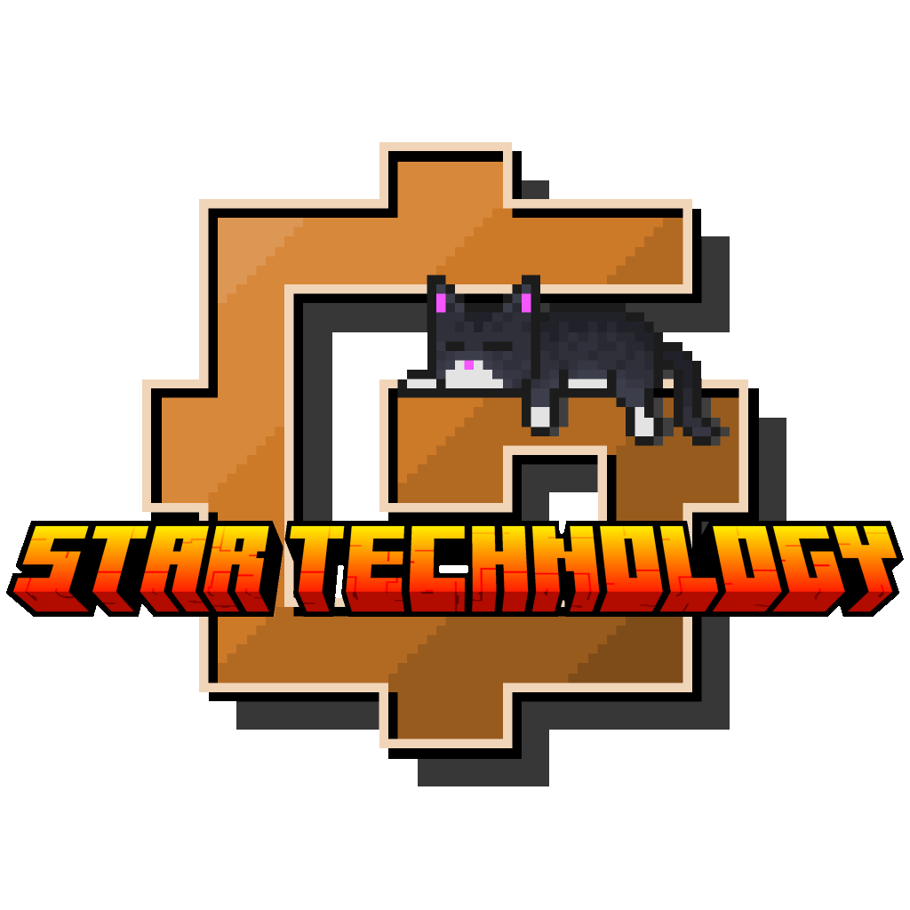

<p align="center"></p>
<h1 align="center">GregTech CEu: Modern - StarT Fork</h1>
<p align="center">A community fork of GregTech CEu: Modern maintained by the StarT Development Team</p>
<h1 align="center">
    <a href="https://github.com/StarT-Dev-Team/GTM-StarT-Fork/blob/main/LICENSE"></a>
    <a href="https://github.com/StarT-Dev-Team/GTM-StarT-Fork/releases"></a>
</h1>

## About This Fork

This is a community-maintained fork of [GregTech CEu: Modern](https://github.com/GregTechCEu/GregTech-Modern) by the StarT Development Team. 

**Original Mod:** [GregTech CEu: Modern](https://www.curseforge.com/minecraft/mc-mods/gregtechceu-modern)  
**Original Repository:** [GregTechCEu/GregTech-Modern](https://github.com/GregTechCEu/GregTech-Modern)

### Fork Status
This fork has diverged from upstream and does **not track versions 8.x.x and later**.

Development is now independent. Upstream fixes or improvements may be selectively
ported when they make sense for this fork, but version parity with upstream is
not a goal.

This fork should be considered a separate project with its own design goals.

### Fork Goals
#### Project Goals
- Maintain a version of GTm tailored for the needs of the Star Technology modpack.
- Improve configurability and pack-developer control.
- Keep mechanics consistent and intuitive for players.
- Prioritize maintainability over heavy mixins or fragile patches from addons.

#### Development Goals
- Revert or adjust upstream features that do not fit the intended gameplay design.
- Introduce new features that would otherwise require large external modifications.
- Improve internal APIs to make extending the mod easier.
- Add general quality-of-life improvements and bug fixes.

### Changes from upstream
To see all the changes, additions, reverts and bug fixes of this fork, see [CHANGELOG.md](CHANGELOG.md)

## Versioning system

This fork follows the older versioning system of GTm (ex. 1.6.4) with some rules.
The versioning is loosely based on the update cycles of Star Technology. 
The second number represents the major version (`1.7.x` -> Theta update, `1.8.x` -> Iota update, etc.), while the third number represents the minor version (0-indexed, where `1.7.0` -> Theta 1, `1.7.1` -> Theta 2, etc.).
In case of this mod being updated for hotfix updates, this is represented by adding a lowercase letter of the Latin alphabet, incremented for every time it was updated in hotfix updates (ex. `1.7.0a`, `1.7.0b`).

## Credits

### Fork Development Team

- **trulyno** - Fork Maintainer
- **UltraPuPower1** - Developer
- **n1xx1** - Developer
- **Luzifer Senpai** - Developer
- **Kolja** - Developer

### Original GregTech CEu: Modern Team

This fork is based on the excellent work of the GregTech CEu: Modern development team:

- **KilaBash** - Original GTCEu Modern Developer
- **screret** - Original GTCEu Modern Developer
- **serenibyss** - Original GTCEu Modern Developer
- **Tech22** - Original GTCEu Modern Developer
- **YoungOnion** - Original GTCEu Modern Developer
- **Mikerooni** - Original GTCEu Modern Developer
- **Ghostipedia** - Original GTCEu Modern Developer

## For Developers

To add this fork as a dependency to your project, first add it to your `build.gradle`:

```groovy
repositories {
    maven {
        name = "expandiumReleases"
        url = "https://repo.expandium.net/releases"
        content {
            includeGroup 'com.gregtechceu.gtceu'
        }
    }
    maven {
        name = "githubPackages"
        url = "https://maven.pkg.github.com/StarT-Dev-Team/GTM-StarT-Fork"
        content {
            includeGroup 'com.gregtechceu.gtceu'
        }
    }
}
```

Then you can add it as a dependency, providing a `{gtm_version}` parameter for the version:

```groovy
dependencies {
    modImplementation("com.gregtechceu.gtceu:gtceu-st-1.20.1:${gtm_version}") { transitive = false }
}
```

## Contributing

If you wish to contribute to this project, fork this repository and create a pull request pointing towards the `develop` branch.

### IDE Requirements (when using IntelliJ IDEA)

For contributing to this mod, the [Lombok plugin](https://plugins.jetbrains.com/plugin/6317-lombok) for IntelliJ IDEA is strictly required.  
Additionally, the [Minecraft Development plugin](https://plugins.jetbrains.com/plugin/8327-minecraft-development) is recommended.

## Credited Works

- Most textures are originally from [Gregtech: Refreshed](https://modrinth.com/resourcepack/gregtech-refreshed) by @ULSTICK. With some consistency edits and additions by @Ghostipedia.
- Some textures are originally from the **[ZedTech GTCEu Resourcepack](https://github.com/brachy84/zedtech-ceu)**, with some changes made by the community.
- New material item textures by @TTFTCUTS and @Rosethorns.
- Wooden Forms, World Accelerators, and the Extreme Combustion Engine are from the **[GregTech: New Horizons Modpack](https://www.curseforge.com/minecraft/modpacks/gt-new-horizons)**.
- Primitive Water Pump is from the **[IMPACT: GREGTECH EDITION Modpack](https://gt-impact.github.io/#/)**.
- Ender Fluid Link Cover, Auto-Maintenance Hatch, Optical Fiber, and Data Bank Textures are from **[TecTech](https://github.com/Technus/TecTech)**.
- Steam Grinder is from **[GregTech++](https://www.curseforge.com/minecraft/mc-mods/gregtech-gt-gtplusplus)**.
- Certificate of Not Being a Noob Anymore is from **[Crops++](https://www.curseforge.com/minecraft/mc-mods/berries)**.

See something we forgot to credit? Reach out to us by opening an issue and ask for appropriate credit, we will happily mark it here.

## License

This project is licensed under the LGPL-3.0 license - see the [LICENSE](LICENSE) file for details.

This fork maintains the same license as the original GregTech CEu: Modern project.
